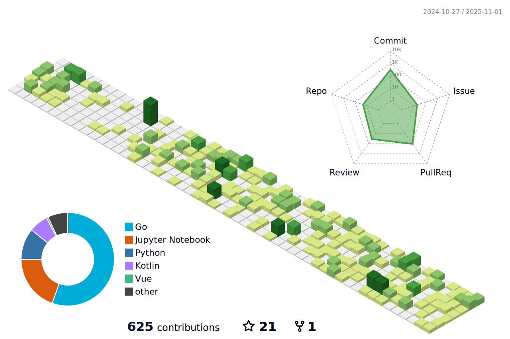

  <picture>
    <source
      media="(prefers-color-scheme: dark)"
      srcset="./profile-3d-night.svg"
    />
    <source
      media="(prefers-color-scheme: light)"
      srcset="./profile-3d.svg"
    />
    
  </picture>

  <picture>
    <source media="(prefers-color-scheme: dark)" srcset="https://github-readme-stats.vercel.app/api?username=alanxtl&count_private=true&include_all_commits=true&show_icons=true&hide_border=true&theme=tokyonight" />
    <source media="(prefers-color-scheme: light)" srcset="https://github-readme-stats.vercel.app/api?username=alanxtl&count_private=true&include_all_commits=true&show_icons=true&hide_border=true" />
    
  </picture>
  <picture>
    <source media="(prefers-color-scheme: dark)" srcset="https://streak-stats.demolab.com/?user=alanxtl&theme=transparent&date_format=%5BY.%5Dn.j&count_private=true&include_all_commits=true&hide_border=true&theme=tokyonight" />
    <source media="(prefers-color-scheme: light)" srcset="https://streak-stats.demolab.com/?user=alanxtl&theme=transparent&date_format=%5BY.%5Dn.j&count_private=true&include_all_commits=true&hide_border=true" />
    
  </picture>

